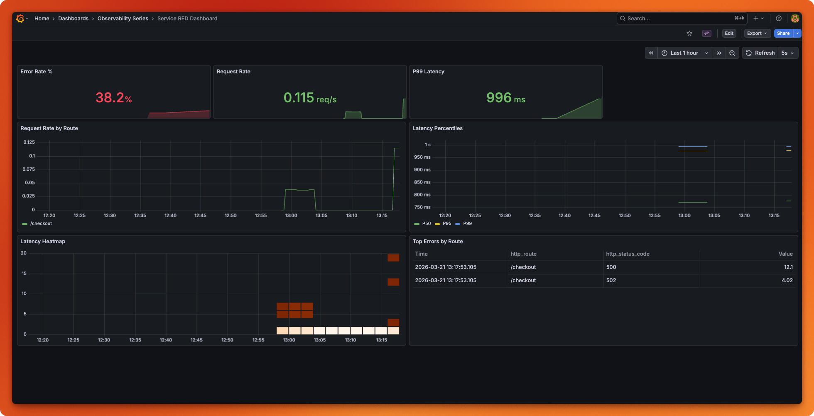

# Chapter 10: Dashboards & the RED Method


*grafana dashboard*

Build actionable Grafana dashboards using the RED method (Rate, Errors, Duration) for the API Gateway and Order Service.

## What Changed from Chapter 9

| Aspect | Chapter 9 | Chapter 10 |
|--------|-----------|------------|
| Visualization | None — raw metrics in Prometheus | Grafana dashboards with RED panels |
| Infrastructure | Collector + Jaeger + Prometheus | Added Grafana 12.3.0 with auto-provisioning |
| Data sources | Manual Prometheus queries | Provisioned Prometheus + Jaeger datasources |
| Dashboards | None | RED dashboard JSON (dashboard-as-code) |
| App code | Sampling & PII scrubbing | Identical — no application changes |

**Same base**: Two-service architecture (API Gateway + Order Service), all error handling patterns, Loguru + OTel JSON correlation, Collector pipeline with tail sampling and PII scrubbing from ch9.

## File Structure

```
ch10-dashboards/
├── api_gateway.py                 # API Gateway (identical to ch9)
├── order_service.py               # Order Service (identical to ch9)
├── logging_setup.py               # Loguru + OTel correlation (identical to ch9)
├── pyproject.toml                 # Dependencies (same as ch9)
├── Makefile                       # All commands (adds Grafana targets)
├── docker-compose.yml             # Adds Grafana service to the stack
├── otel-collector-config.yaml     # Collector config (identical to ch9)
├── prometheus.yml                 # Prometheus config (identical to ch9)
├── README.md                      # This file
└── grafana/
    └── provisioning/
        ├── datasources/
        │   └── datasources.yaml   # Auto-provisions Prometheus + Jaeger
        └── dashboards/
            ├── dashboards.yaml    # Dashboard loader config
            └── red-dashboard.json # RED dashboard (Rate, Errors, Duration)
```

## Quick Start

1. **Install dependencies:**
   ```bash
   uv sync
   ```

2. **Start infrastructure** (Collector + Jaeger + Prometheus + Grafana):
   ```bash
   make infra-up
   ```

3. **Start both services** (in separate terminals):
   ```bash
   # Terminal 1: Order Service
   make run-order

   # Terminal 2: API Gateway
   make run-gateway
   ```

4. **Generate traffic** to populate the dashboard:
   ```bash
   make run-traffic
   ```

5. **Open the RED dashboard:**
   ```bash
   make open-grafana
   ```
   Or navigate to: [http://localhost:3000/d/red-dashboard](http://localhost:3000/d/red-dashboard)

   Default credentials: `admin` / `admin`

6. **Tear down:**
   ```bash
   make infra-down
   ```

## RED Dashboard Panels

The provisioned dashboard includes these panels in inverted-pyramid layout:

### Top Row — Stat Panels (Glanceable)
| Panel | PromQL | Purpose |
|-------|--------|---------|
| Error Rate % | `sum(rate(...{http_status_code=~"5.."}[5m])) / sum(rate(...[5m])) * 100` | Is it broken? |
| Request Rate | `sum(rate(otel_gateway_requests_total[5m]))` | Is traffic flowing? |
| P99 Latency | `histogram_quantile(0.99, ...)` | Is it slow? |

### Middle Row — Time Series (Trends)
| Panel | Purpose |
|-------|---------|
| Request Rate by Route | Traffic distribution across endpoints |
| Latency Percentiles (P50, P95, P99) | Performance trends and outlier detection |

### Bottom Row — Detail (Investigation)
| Panel | Purpose |
|-------|---------|
| Latency Heatmap | Distribution patterns (bimodal, long-tail) |
| Top Errors by Route | Which routes and status codes are failing |

## Key Concepts

### The RED Method
- **R**ate: Requests per second
- **E**rrors: Failed requests per second (or error percentage)
- **D**uration: Latency distribution (P50, P95, P99)

### Dashboard-as-Code
The dashboard JSON is version-controlled and auto-loaded by Grafana on startup. No manual UI setup needed.

### Data Source Provisioning
Prometheus and Jaeger data sources are configured via YAML — no clicking through the Grafana UI.

## PromQL Examples

```promql
# Request rate by route
sum(rate(otel_gateway_requests_total[5m])) by (http_route)

# Error rate as percentage
sum(rate(otel_gateway_requests_total{http_status_code=~"5.."}[5m]))
/ sum(rate(otel_gateway_requests_total[5m])) * 100

# P99 latency
histogram_quantile(0.99, sum(rate(otel_gateway_request_duration_milliseconds_bucket[5m])) by (le))

# Order Service: orders created per second
rate(otel_orders_created_total[5m])

# Order Service: processing latency P99
histogram_quantile(0.99, sum(rate(otel_orders_processing_duration_milliseconds_bucket[5m])) by (le))
```

## Troubleshooting

- **Grafana shows "No data"**: Wait 2–3 minutes for Prometheus to accumulate data, then refresh. Check that Prometheus is scraping: http://localhost:9090/targets
- **Dashboard not loading**: Verify Grafana can reach Prometheus: `make verify-grafana`
- **Collector not healthy**: Check logs with `make logs`
