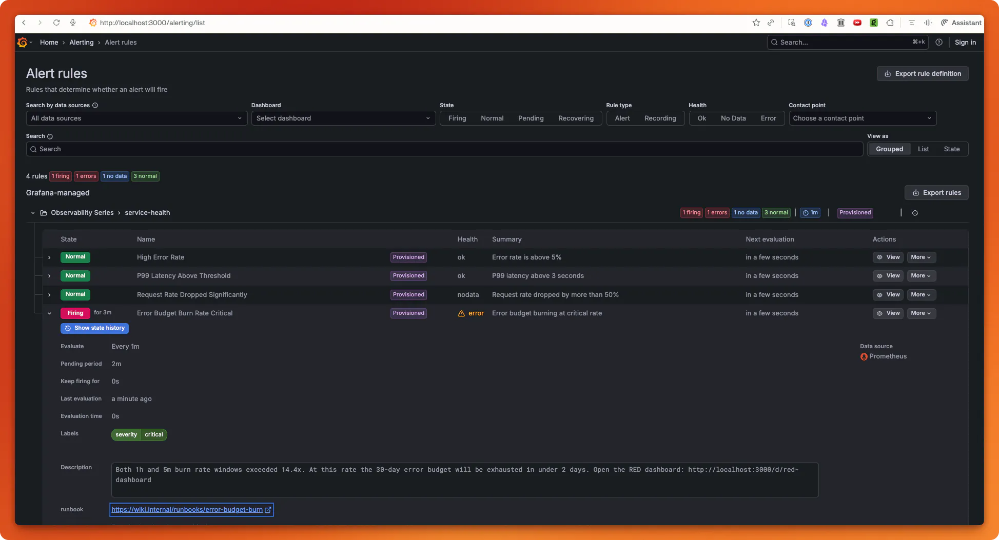

*Grafana Alerts*
# Chapter 11: Alerting & Service Level Objectives (SLOs)

Define SLIs and SLOs for your services, configure symptom-based alerts in Grafana, and build error budget burn rate alerts that page you before users notice.

## What Changed from Chapter 10

| Aspect | Chapter 10 | Chapter 11 |
|--------|------------|------------|
| Alerting | None — dashboards only | 4 provisioned alert rules (error rate, latency, traffic drop, burn rate) |
| SLOs | Not defined | 99% availability SLO with error budget tracking |
| Contact points | None | Slack + PagerDuty contact points (configurable) |
| Routing | None | Severity-based routing (critical → PagerDuty, all → Slack) |
| Testing | None | promtool unit tests for alert rules |
| Grafana config | Dashboard provisioning | Added `GF_UNIFIED_ALERTING_ENABLED=true` + alerting provisioning |
| Dashboard | RED dashboard | RED dashboard + error budget burn rate panel |
| App code | Identical to ch9 | Identical — no application changes |

**Same base**: Two-service architecture (API Gateway + Order Service), all error handling patterns, Loguru + OTel JSON correlation, Collector pipeline with tail sampling and PII scrubbing.

## File Structure

```
ch11-alerting-slos/
├── api_gateway.py                 # API Gateway (identical to ch10)
├── order_service.py               # Order Service (identical to ch10)
├── logging_setup.py               # Loguru + OTel correlation (identical to ch10)
├── simulate_errors.py             # Error burst simulator for testing alerts
├── pyproject.toml                 # Dependencies (same as ch10)
├── Makefile                       # All commands (adds alerting targets)
├── docker-compose.yml             # Adds GF_UNIFIED_ALERTING_ENABLED
├── otel-collector-config.yaml     # Collector config (identical to ch10)
├── prometheus.yml                 # Prometheus config (identical to ch10)
├── prometheus-alert-rules.yml     # Prometheus-native alert rules (for promtool)
├── test_alerts.yaml               # promtool unit tests for alert rules
├── README.md                      # This file
└── grafana/
    └── provisioning/
        ├── alerting/
        │   ├── alerts.yaml        # Alert rules (error rate, latency, traffic, burn rate)
        │   ├── contactpoints.yaml # Notification channels (Slack, PagerDuty)
        │   └── policies.yaml      # Alert routing (severity → channel)
        ├── datasources/
        │   └── datasources.yaml   # Auto-provisions Prometheus + Jaeger
        └── dashboards/
            ├── dashboards.yaml    # Dashboard loader config
            └── red-dashboard.json # RED dashboard + burn rate panel
```

## Quick Start

1. **Install dependencies:**
   ```bash
   uv sync
   ```

2. **Start infrastructure** (Collector + Jaeger + Prometheus + Grafana):
   ```bash
   make infra-up
   ```

3. **Start both services** (in separate terminals):
   ```bash
   # Terminal 1: Order Service
   make run-order

   # Terminal 2: API Gateway
   make run-gateway
   ```

4. **Generate traffic** to establish a baseline:
   ```bash
   make run-traffic
   ```

5. **View alert rules:**
   ```bash
   make open-alerts
   ```
   Or navigate to: [http://localhost:3000/alerting/list](http://localhost:3000/alerting/list)

6. **Simulate an incident** to trigger alerts:
   ```bash
   # Stop the Order Service (Ctrl+C in the run-order terminal)
   # Then run:
   make simulate-errors
   ```

7. **Test alert rules** with promtool:
   ```bash
   make test-alerts
   ```

8. **Tear down:**
   ```bash
   make infra-down
   ```

## Alert Rules

| Alert | Condition | For | Severity |
|-------|-----------|-----|----------|
| High Error Rate | Error rate > 5% | 5 min | Critical |
| P99 Latency Above Threshold | P99 > 3000ms | 10 min | Warning |
| Request Rate Dropped | Rate < 50% of 1h ago | 5 min | Warning |
| Error Budget Burn Rate | Burn rate > 14.4x (both 1h and 5m windows) | 2 min | Critical |

### Error Budget Burn Rate

For a **99% availability SLO** (1% error budget) over 30 days:

| Burn Rate | Budget Exhaustion Time | Meaning |
|-----------|----------------------|---------|
| 1x | 30 days | On budget |
| 5x | 6 days | Warning |
| 14.4x | ~2 days | Critical — alert fires |
| 100x | 7.2 hours | Emergency |

The multi-window approach (1h + 5m) prevents false positives from brief spikes while catching sustained budget burn.

## Alert Routing

| Severity | Contact Point | Channel |
|----------|--------------|---------|
| Warning | Slack | #engineering-alerts |
| Critical | Slack + PagerDuty | #engineering-alerts + on-call page |

Configure by setting environment variables:
- `SLACK_WEBHOOK_URL` — Slack incoming webhook URL
- `PAGERDUTY_KEY` — PagerDuty integration key

## Testing Alert Rules

The `prometheus-alert-rules.yml` file contains the same alert conditions in Prometheus-native format (not Grafana provisioning format), enabling unit testing with `promtool`:

```bash
# Install promtool (macOS)
brew install prometheus

# Run tests
promtool test rules test_alerts.yaml
```

Tests verify:
- 10% error rate → HighErrorRate alert fires
- 0.5% error rate → HighErrorRate alert does NOT fire

## Troubleshooting

- **Alerts show "No data"**: Ensure traffic has been flowing for at least 5 minutes. Run `make run-traffic`.
- **Alert rules not visible**: Check `make verify-alerts`. Grafana may need a restart after provisioning changes: `docker compose restart grafana`.
- **promtool not found**: Install with `brew install prometheus` (macOS) or download from [prometheus.io](https://prometheus.io/download/).
- **Contact points failing**: For local dev, alerts are visible in the Grafana Alerting UI even without configured Slack/PagerDuty.
