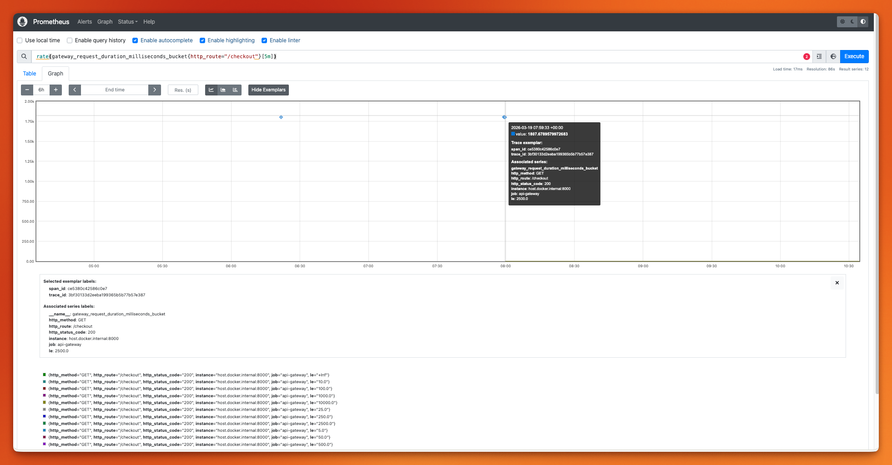

# Chapter 6: Correlating Telemetry Signals — The Pivot Workflow

This chapter connects the three telemetry pillars (Logs, Traces, Metrics) so you can start from a dashboard spike and drill down to the exact line of code that caused it.

## What Changed from Chapter 5

| Aspect | Chapter 5 | Chapter 6 |
|--------|-----------|-----------|
| Logging | stdlib `logging` | Loguru with OTel patcher (`trace_id`, `span_id`, `span_name`) |
| Log format | Plain text | Structured JSON with trace correlation |
| Metric exemplars | Not attached | `context.get_current()` passed to `.record()` |
| Shared module | None | `logging_setup.py` (reusable across services) |
| Pivot workflow | Not possible | Metrics → Traces → Logs via `trace_id` |

**Same base**: Two-service architecture (API Gateway + Order Service), Jaeger for traces, Prometheus for metrics, `opentelemetry-instrument` CLI.

## Files

| File | Description | Port |
|------|-------------|------|
| `logging_setup.py` | Shared Loguru setup with OTel trace context injection | — |
| `api_gateway.py` | Upstream service — Loguru logging, metrics middleware with exemplars | 8000 |
| `order_service.py` | Downstream service — business metrics with exemplars, span-boundary logging | 8001 |
| `docker-compose.yml` | Jaeger + Prometheus infrastructure | — |
| `prometheus.yml` | Prometheus scrape configuration for both services | — |

## Quick Start

1. **Start infrastructure (Jaeger + Prometheus):**
   ```bash
   make infra-up
   ```

2. **Start both services** (in separate terminals):
   ```bash
   # Terminal 1: Order Service
   make run-order

   # Terminal 2: API Gateway
   make run-gateway
   ```

3. **Send a request:**
   ```bash
   make run-request
   ```

4. **Generate traffic for meaningful metrics:**
   ```bash
   make run-traffic
   ```

## The Pivot Workflow

### Step 1: Metrics → Trace (via Exemplars)

Open [Prometheus UI](http://localhost:9090) and run this query first (best for exemplar hover):

```promql
rate(gateway_request_duration_milliseconds_bucket{http_route="/checkout"}[5m])
```


In Prometheus 2.x, toggle **"Show Exemplars"**. In Prometheus 3.x, the old button may not be visible; use the graph display/options control near the chart toolbar and enable exemplars there.

If the UI control is still missing, append `&g0.show_exemplars=1` to the graph URL, refresh, and hover the markers to see `trace_id=<hex>`.

If exemplars still do not render in the UI, recreate Prometheus with the pinned image used in this chapter:

```bash
docker-compose down
docker-compose up -d --force-recreate prometheus
```

Then compute p99 latency for `/checkout`:

```promql
histogram_quantile(
   0.99,
   sum by (le) (
      rate(gateway_request_duration_milliseconds_bucket{http_route="/checkout"}[5m])
   )
)
```

### Step 2: Trace → Logs

Open [Jaeger UI](http://localhost:16686), paste the `traceID`, and inspect the waterfall. Copy the `trace_id` from the slowest span.

### Step 3: Logs by trace_id

Search structured JSON logs (from stdout) by `trace_id`:

```bash
# Example: filter logs for a specific trace
cat service_output.log | jq 'select(.trace_id == "<trace_id_here>")'
```

## Key Concepts

- **Exemplars** — sample `trace_id` references attached to metric data points; the bridge from Metrics → Traces.
- **OTel Patcher** — Loguru patcher that injects `trace_id`, `span_id`, `span_name` into every log record.
- **Span-boundary logging** — logging at entry/exit of each span for reliable Trace → Log correlation.

## Service Names

- `api-gateway` (traces in Jaeger)
- `order-service` (traces in Jaeger)
