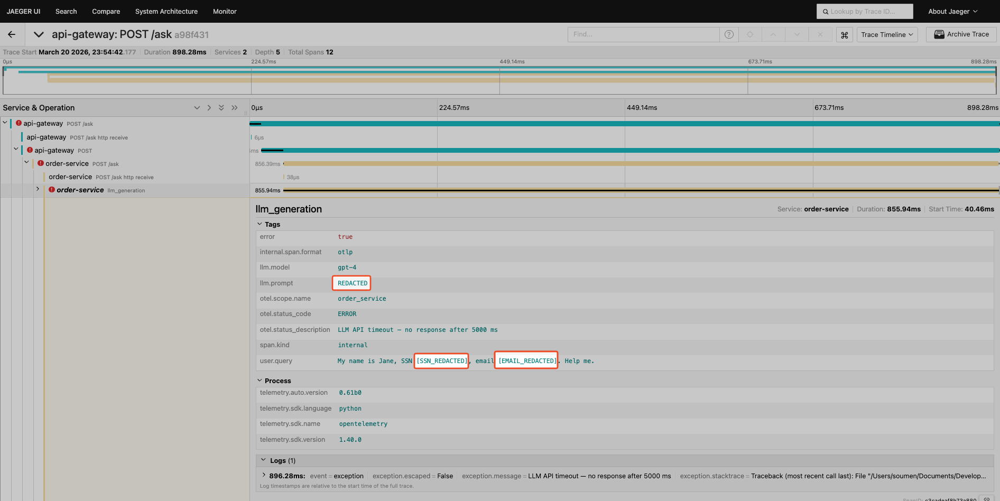

# Chapter 9: Sampling & PII Scrubbing

Keep 100 % of error traces while sampling successes, and redact sensitive data like GenAI prompts before telemetry leaves your infrastructure.

## What Changed from Chapter 8

| Aspect | Chapter 8 | Chapter 9 |
|--------|-----------|-----------|
| Sampling | None — every span is kept | Tail sampling: 100 % errors, 100 % slow, 5 % normal |
| PII handling | None — attributes pass through | Transform processor scrubs `llm.prompt`, `llm.completion`, emails, SSNs |
| Collector config | Pass-through pipeline | `transform` → `tail_sampling` → `batch` processor chain |
| App code | Standard checkout/product endpoints | Added `/ask` GenAI-style endpoint with `llm.*` and `user.query` attributes |
| Collector image | `contrib:latest` (MVP) | `contrib:0.120.0` (pinned, includes `tailsamplingprocessor` + `transformprocessor`) |

**Same base**: Two-service architecture (API Gateway + Order Service), error handling patterns from ch7, Loguru + OTel JSON correlation, Collector pipeline from ch8.

## File Structure

```
ch9-sampling-pii/
├── api_gateway.py                 # API Gateway — adds /ask GenAI proxy endpoint
├── order_service.py               # Order Service — adds /ask GenAI-style endpoint
├── logging_setup.py               # Loguru + OTel correlation (identical to ch7/ch8)
├── pyproject.toml                 # Dependencies (same as ch8)
├── Makefile                       # All commands
├── docker-compose.yml             # Collector + Jaeger + Prometheus (pinned)
├── otel-collector-config.yaml     # Tail sampling + PII transform + batch
├── prometheus.yml                 # Scrapes Collector at :8889
└── README.md                      # This file
```

## Quick Start

1. **Install dependencies:**
   ```bash
   uv sync
   ```

2. **Start infrastructure:**
   ```bash
   make infra-up
   ```

3. **Start both services** (in separate terminals):
   ```bash
   # Terminal 1: Order Service
   make run-order

   # Terminal 2: API Gateway
   make run-gateway
   ```

4. **Generate traffic** (mix of normal, error, and GenAI requests):
   ```bash
   make run-traffic
   ```

5. **Verify sampling and PII scrubbing:**



   - Jaeger: [http://localhost:16686](http://localhost:16686)
     - All error traces should be present (red spans)
     - Only ~5 % of fast, successful traces should appear
   - Collector logs: `make logs` — look for sampling decisions
   - Check PII is scrubbed: `make verify-pii`

6. **Tear down:**
   ```bash
   make infra-down
   ```

## Tail Sampling Policies

The Collector evaluates three policies in order. A trace is kept if **any** policy matches:

| # | Policy | Keeps |
|---|--------|-------|
| 1 | `errors-policy` | 100 % of traces with ERROR status |
| 2 | `latency-policy` | 100 % of traces slower than 2 000 ms |
| 3 | `probabilistic-policy` | 5 % of remaining (fast, successful) traces |

Result: 80–95 % volume reduction while keeping every trace you'd want to investigate.

## PII Scrubbing

The `transform` processor runs **before** tail sampling to ensure PII is never exported:

| Attribute | Action |
|-----------|--------|
| `llm.prompt` | Replaced with `REDACTED` |
| `llm.completion` | Replaced with `REDACTED` |
| `user.query` (emails) | Email addresses replaced with `[EMAIL_REDACTED]` |
| `user.query` (SSNs) | SSN patterns replaced with `[SSN_REDACTED]` |

### Processor Order (matters!)

```
memory_limiter → transform → tail_sampling → batch → exporters
```

1. **`memory_limiter`** — Safety net for memory
2. **`transform`** — Scrub PII first (before any data is exported, even to debug)
3. **`tail_sampling`** — Then decide what to keep
4. **`batch`** — Batch the remaining data for efficient export

## Verification Checklist

After starting the stack, verify in order:

1. **Collector ready**: `make verify-collector`
2. **Spans flowing**: `make run-request` then check `make logs`
3. **Sampling active**: Send 100 requests with `make run-traffic`, check Jaeger — only errors + ~5 % normals should appear
4. **PII scrubbed**: `make run-genai` then `make verify-pii` — `llm.prompt` and `llm.completion` should show `REDACTED`
5. **Jaeger traces**: `make verify-jaeger` — open link, select service, search
6. **Prometheus UP**: `make verify-prometheus` — open targets link

## Prometheus Queries

```promql
# Total gateway requests
otel_gateway_requests_total

# Total orders created
otel_orders_created_total

# Error rate by error type
rate(otel_orders_errors_total[5m])

# Sampling effect: compare receiver vs exporter span counts
otelcol_receiver_accepted_spans_total
otelcol_exporter_sent_spans_total
```

## Architecture

```
┌─────────────┐     OTLP      ┌──────────────────────────────────┐    OTLP     ┌─────────┐
│ API Gateway │───────────────▶│                                  │────────────▶│ Jaeger  │
│  :8000      │                │        OTel Collector            │             │ :16686  │
└─────────────┘                │  :4317 (gRPC)                    │             └─────────┘
                               │                                  │
┌─────────────┐     OTLP      │  ┌──────────┐  ┌──────────────┐  │  scrape     ┌────────────┐
│ Order Svc   │───────────────▶│  │transform │→ │tail_sampling │  │◀────────────│ Prometheus │
│  :8001      │                │  │(PII scrub)│  │(keep errors) │  │             │ :9090      │
└─────────────┘                │  └──────────┘  └──────────────┘  │             └────────────┘
                               └──────────────────────────────────┘
```
